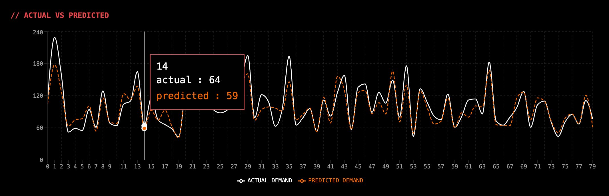

# EdgeCast — Demand Forecasting Engine

An end-to-end machine learning system for time-series demand prediction, backed by MySQL and served through a full-stack web interface.

---

## Table of Contents

- [Overview](#overview)
- [Dashboard Snapshot](#dashboard-snapshot)
- [Architecture](#architecture)
- [Tech Stack](#tech-stack)
- [Prerequisites](#prerequisites)
- [Adding Your CSV Data](#adding-your-csv-data)
- [Installation](#installation)
- [Running the Application](#running-the-application)
- [File Structure](#file-structure)
- [Model Performance](#model-performance)
- [Project Goals](#project-goals)

---

## Overview

EdgeCast is a robust time-series analysis and demand forecasting system. It ingests historical demand data, applies automated preprocessing, and leverages an optimized XGBoost model to produce high-accuracy predictions.

The system represents a complete pipeline migration from static CSV data sources to a fully integrated MySQL database infrastructure, wrapped in a web-based frontend for real-time interaction.

> This repository corresponds to the `aansh-1080p/db_full_and_final` directory.

---

## Dashboard Snapshot

The interactive forecast dashboard overlays actual vs. predicted demand across the full time-series range. Hovering any data point surfaces the index, actual value, and predicted value inline.



> **Figure:** Actual demand (white) vs. predicted demand (orange dashed) across 80 time-series entries. 

---

## Architecture

```
Historical Data (MySQL / CSV)
          │
          ▼
┌─────────────────────────┐
│     Data Processing     │
│     (prep_final)        │  Handles missing values, scaling, and feature engineering.
│                         │  Outputs preprocessed_demand_data_final.csv
└──────────┬──────────────┘
           │
   ┌───────┴────────────────────────────┐
   ▼                                    ▼
xg_db_final.ipynb              model_features_sql.pkl
(Model Training)                (Feature Serialization)
   │                                    │
   └───────────────┬────────────────────┘
                   ▼
        ┌─────────────────────┐
        │   XGBoost Engine    │  Generates predictions from time-series inputs.
        │    (.pkl model)     │
        └──────────┬──────────┘
                   │
                   ▼
        ┌─────────────────────┐
        │    Web Interface    │  Displays forecasts via index.html and app.py.
        └─────────────────────┘
```

| Layer              | File                           | Responsibility                                                        |
|--------------------|--------------------------------|-----------------------------------------------------------------------|
| Data Processor     | `prep_final.ipynb`             | Cleans, normalizes, and engineers features from raw demand data.      |
| Model Training     | `xg_db_final.ipynb`            | Defines, trains, and tunes the XGBoost model against MySQL.          |
| Serialization      | `xgboost_demand_model_sql.pkl` | The serialized, production-ready XGBoost model.                      |
| Feature Map        | `model_features_sql.pkl`       | Expected feature schema for incoming prediction requests.             |
| Application Server | `app.py`                       | Routes prediction requests from the frontend to the ML model.        |
| Frontend Interface | `index.html`                   | User-facing dashboard for interacting with forecast data.             |

---

## Tech Stack

| Component         | Technology                      |
|-------------------|---------------------------------|
| Machine Learning  | Python, XGBoost, Scikit-Learn   |
| Data Manipulation | Pandas, NumPy                   |
| Database          | MySQL                           |
| Backend Framework | Python — Flask / FastAPI        |
| Frontend          | HTML, CSS, JavaScript, Node.js  |
| Visualization     | Matplotlib, Seaborn, Plotly     |
| Dashboard         | Streamlit                       |
| Dev Frontend      | Vite, React                     |
| Environment       | Jupyter Notebooks, venv         |

---

## Prerequisites

Before deploying EdgeCast, ensure the following are installed:

- Python 3.8 or higher
- MySQL Server (running and accessible)
- Node.js 18+ and npm
- pip (Python package installer)

---

## Adding Your CSV Data

EdgeCast expects a historical demand CSV file placed at:

```
2nd_Eval(updated)/demand_forecasting (2).csv
```

### Required CSV Format

Your file must contain at minimum the following columns:

| Column        | Type    | Description                              |
|---------------|---------|------------------------------------------|
| `date`        | string  | Date of the demand record (`YYYY-MM-DD`) |
| `demand`      | integer | Observed demand value for that period    |
| `product_id`  | string  | Identifier for the SKU or product        |
| `region`      | string  | Geographic region or store location      |

### Example

```csv
date,demand,product_id,region
2023-01-01,64,SKU-001,North
2023-01-02,78,SKU-001,North
2023-01-03,59,SKU-001,North
2023-01-04,91,SKU-002,South
```

### Loading into MySQL

Once your CSV is ready, import it into MySQL using the following:

```sql
LOAD DATA INFILE '/path/to/demand_forecasting.csv'
INTO TABLE demand_data
FIELDS TERMINATED BY ','
ENCLOSED BY '"'
LINES TERMINATED BY '\n'
IGNORE 1 ROWS;
```

Or use the Python loader inside `prep_final.ipynb`:

```python
import pandas as pd
import mysql.connector

df = pd.read_csv("demand_forecasting (2).csv")

conn = mysql.connector.connect(
    host="localhost",
    user="your_user",
    password="your_password",
    database="your_database"
)

df.to_sql("demand_data", con=conn, if_exists="replace", index=False)
```

> If you are working purely from CSV without MySQL, the pipeline will fall back to reading `preprocessed_demand_data_final.csv` directly.

---

## Installation

### 1. Create and Activate a Virtual Environment

**Create the environment:**

```bash
python -m venv venv
```

**Activate — macOS / Linux:**

```bash
source venv/bin/activate
```

**Activate — Windows (Command Prompt):**

```cmd
venv\Scripts\activate.bat
```

**Activate — Windows (PowerShell):**

```powershell
venv\Scripts\Activate.ps1
```

> To deactivate at any time, run `deactivate`.

---

### 2. Install Core Python Dependencies

```bash
pip install pandas numpy scikit-learn xgboost mysql-connector-python flask
```

---

### 3. Install Streamlit and Visualization Components

```bash
pip install streamlit matplotlib seaborn plotly altair bokeh
```

| Package     | Purpose                                               |
|-------------|-------------------------------------------------------|
| `streamlit` | Interactive dashboard and UI for ML apps              |
| `matplotlib`| Core plotting library for charts and figures          |
| `seaborn`   | Statistical data visualization built on matplotlib    |
| `plotly`    | Interactive charts (works natively inside Streamlit)  |
| `altair`    | Declarative statistical visualization                 |
| `bokeh`     | Interactive web-ready plots                           |

---

### 4. Install All Python Dependencies in One Command

```bash
pip install pandas numpy scikit-learn xgboost mysql-connector-python flask \
            streamlit matplotlib seaborn plotly altair bokeh \
            jupyterlab ipykernel
```

---

### 5. Save and Restore Dependencies

**Save current environment to a file:**

```bash
pip freeze > requirements.txt
```

**Restore on another machine:**

```bash
pip install -r requirements.txt
```

---

### 6. Set Up the Vite + React Frontend

```bash
cd DB_PROJ
npm create vite@latest . -- --template react
npm install
npm install axios react-router-dom recharts tailwindcss @tailwindcss/vite
```

| Package            | Purpose                                               |
|--------------------|-------------------------------------------------------|
| `axios`            | HTTP client for calling the Flask/FastAPI backend     |
| `react-router-dom` | Client-side routing between pages                     |
| `recharts`         | Chart components built for React                      |
| `tailwindcss`      | Utility-first CSS framework                           |

**Start the Vite development server:**

```bash
npm run dev
```

---

## Running the Application

**Start the Flask backend:**

```bash
python 2nd_Eval(updated)/app.py
```

**Start the Streamlit dashboard:**

```bash
streamlit run 2nd_Eval(updated)/app.py
```

**Start the Vite frontend dev server:**

```bash
cd DB_PROJ
npm run dev
```

---

## File Structure

```
aansh-1080p/db_full_and_final/
├── venv/                                   # Python virtual environment (do not commit)
├── requirements.txt                        # Frozen Python dependencies
├── dashboard_snapshot.png                  # Dashboard preview image
│
├── 2nd_Eval(updated)/
│   ├── app.py                              # Backend server and API routing
│   ├── demand_forecasting (2).csv          # Raw historical dataset
│   ├── get-pip.py                          # Environment setup script
│   ├── model_features_sql.pkl              # Serialized feature columns
│   ├── prep_final.ipynb                    # Data cleaning and preprocessing notebook
│   ├── preprocessed_demand_data_final.csv  # Cleaned data ready for training
│   ├── xg_db_final.ipynb                   # XGBoost model training and evaluation
│   └── xgboost_demand_model_sql.pkl        # Serialized trained XGBoost model
│
└── DB_PROJ/
    ├── eslint.config.js                    # Linter configuration for frontend code
    ├── index.html                          # Web interface entry point
    ├── package.json                        # Node.js project metadata and scripts
    ├── package-lock.json                   # Dependency tree lock
    ├── vite.config.js                      # Vite configuration
    └── public/
        ├── favicon.svg
        ├── icons.svg
        └── logo.png
```

> Add `venv/`, `node_modules/`, and `__pycache__/` to your `.gitignore`.

---

### Recommended `.gitignore` entries

```gitignore
# Python
venv/
__pycache__/
*.pyc
*.pyo
*.pkl
.env

# Node
node_modules/
dist/
.DS_Store
```

---

## Model Performance

Evaluated against standard regression metrics to ensure reliability in demand prediction.

| Metric                      | Score   | Description                                                                |
|-----------------------------|---------|----------------------------------------------------------------------------|
| RMSE (Root Mean Sq. Error)  | `17.16` | Average magnitude of prediction errors. Lower is better.                   |
| MAE (Mean Absolute Error)   | `12.98` | Average absolute distance between predicted and actual values.             |
| R² Score                    | `0.867` | Proportion of variance in the dependent variable explained by the model.   |
| Model Accuracy              | `86.3%` | Percentage of correct predictions within the defined acceptable threshold. |

---

## Project Goals

EdgeCast is built to solve complex inventory and demand planning challenges. By integrating an XGBoost model directly with a relational database and wrapping it in a web application, the project demonstrates a complete, production-ready machine learning lifecycle — from raw data ingestion to live forecast delivery.
